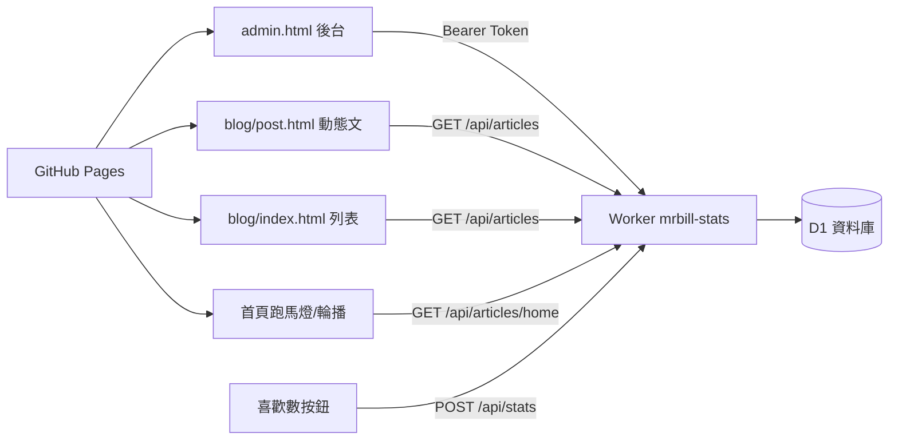

# Mr.Bill 數位實驗室 — 操作手冊（RUNBOOK）

> 最後更新：**2026-06-08**（含 D1／R2／圖片儲存、動態文省時 SOP）  
> 用途：關掉 Cursor 後，照這份文件就能知道怎麼操作、怎麼部署、API 怎麼串、出錯怎麼查。

---

## 一、專案是什麼

| 層級 | 技術 | 說明 |
|------|------|------|
| 前台網站 | GitHub Pages | 靜態 HTML/CSS/JS，網址 `https://mrbill-dev.github.io/` |
| 後台 CMS | `admin.html` | 本機或公司內網開啟，**不推密碼到 Git** |
| 後端 API | Cloudflare Worker `mrbill-stats` | 文章 CRUD、喜歡數、首頁設定 |
| 資料庫 | Cloudflare D1 `mrbill-stats` | SQLite，存動態文章與統計 |



### 1.1 儲存空間：D1、R2、GitHub 圖片（別搞混）

**D1 和 R2 都是 Cloudflare 的服務**（同一個帳號登入），但像 Gmail 和 Google 雲端硬碟——**不同產品、分開算容量，不能共用**。

```text
Cloudflare 帳號
├── Workers   ← API（mrbill-stats）          【已在用】
├── D1        ← 文章／設定／統計（SQLite）    【已在用】
└── R2        ← 圖片檔案（物件儲存）         【尚未建立，要另外開 bucket】

GitHub repo
└── assets/   ← 封面／內文圖（你現在放圖的地方）【已在用】
```

| | **D1 資料庫** | **R2 物件儲存** | **GitHub `assets/`** |
|--|---------------|-----------------|----------------------|
| 比喻 | 筆記本、表格 | 硬碟資料夾、相簿 | 網站專案裡的圖片資料夾 |
| 存什麼 | 標題、slug、正文 HTML、`cover` **路徑字串** | **圖片檔** `.jpg` / `.webp` | **圖片檔**（和程式一起 push） |
| 一筆文章 | 約 5～50 KB（文字） | 封面一張約 200～500 KB（壓圖後） | 同左 |
| 你現在有嗎 | ✅ | ❌ | ✅ |
| 吃 D1 空間嗎 | — | **否**（只會在 D1 多存一個 URL 字串） | **否** |

**免費額度（約略，Cloudflare 免費方案；實際以官方為準）**

| 項目 | D1 | R2 |
|------|----|----|
| 儲存 | 約 **5 GB**（帳號內 D1 加總） | 約 **10 GB／月** |
| 個人部落格夠嗎 | 文字可撐 **幾萬篇** | 壓圖後可撐 **上萬張** |
| 主要限制 | 每日讀寫次數 | 上傳／讀取次數 |

GitHub repo **沒有和 D1 相同的 5GB 標示**，但實務上 **>1GB 就該注意**（push／clone 變慢），不是立刻不能用。

**三種空間對照（記這張就夠）**

| 放什麼 | 現在在哪 | 大概能撐多久（有壓圖） |
|--------|----------|------------------------|
| 文章文字、喜歡數 | D1 | 很久 |
| 封面／內文圖 | GitHub `assets/` | 幾百篇內通常 OK |
| 封面／內文圖（未來可選） | R2 | 個人站通常很夠 |

**目前後台封面欄位**：只能填 `assets/xxx.jpg` 路徑，**沒有瀏覽上傳**；圖要手動放進 `assets/` 再 push。留空封面會用 Unsplash 免費圖 fallback。

**建議圖片規格（現階段 `assets/` 或日後 R2 通用）**

| 項目 | 建議 |
|------|------|
| 格式 | 照片 JPG／WebP；要透明才 PNG |
| 封面尺寸 | **1200×630**（OG／社群分享） |
| 單檔大小 | **≤ 300～500 KB**（上傳 API 可限 ≤ 2MB） |
| 檔名 | `assets/blog-YYYY-MM-DD-slug-og.jpg` |

**分階段策略**

1. **現在**（文章不多）：繼續 `assets/` + 壓圖，不佔 D1。  
2. **文章變多或要做後台上傳**：加 **Worker + R2**，D1 只存 `https://...` URL。  
3. **不建議**：Imgur、免費圖床、Google Drive 直連（連結易失效、OG 常抓不到）。

---

## 二、目前狀態（2026-06-08 請自行勾選）

每次做完部署，在這裡打勾，下次才不會忘：

- [ ] GitHub 已 push 到 `origin/main`
- [ ] Worker 已 `wrangler deploy`
- [ ] D1 migration 已跑到 **v4**（`title_font` 欄位）
- [ ] `js/admin/admin.config.local.js` 已設定（本機，不進 Git）
- [ ] Cloudflare `ADMIN_TOKEN` secret 已設定

**近期重要 commit：**

| Commit | 內容 |
|--------|------|
| `79ebe7e` | SEO/GEO 統一、FAQ、後台 SEO 檢查面板 |
| `0dee1e5` | 標題字體切換（黑體/明體）、雨天文明體修復、Worker `title_font` |
| `a368a65` | 儲存後驗證字體、錯誤提示、快取版本號 |

---

## 三、API 串接（照這做就對了）

### 3.1 Worker 網址（全站共用）

```
https://mrbill-stats.billhuang19get.workers.dev
```

### 3.2 前台會用到的設定檔

| 檔案 | 變數 | 用途 |
|------|------|------|
| `js/blog-articles.config.js` | `BLOG_ARTICLES_API` | 動態文章列表／內文 |
| `js/blog-stats.config.js` | `BLOG_STATS_API` | 喜歡數 |
| `js/admin/admin.config.local.js` | `MRBILL_ADMIN` | **後台專用**（本機，gitignore） |

前台兩個 config **已寫死 production 網址**，本機 Live Server、公司預覽站與 GitHub 正式站**共用同一雲端 Worker**（家裡不需 wrangler dev）。  
本機若出現 `Failed to fetch`：確認 Live Server 為 `http://localhost`（任意 port 皆可，Worker CORS 已放行），且已 `wrangler deploy` 含 localhost CORS 的版本。

### 3.3 後台本機設定（必做一次，不推 Git）

1. 複製範例檔：

   ```
   js/admin/admin.config.example.js
   → js/admin/admin.config.local.js
   ```

2. 填入（密碼要與 Cloudflare Secret 相同）：

   ```javascript
   window.MRBILL_ADMIN = {
     apiBase: "https://mrbill-stats.billhuang19get.workers.dev",
     apiToken: "你的管理密碼（至少 8 字）"
   };
   ```

3. `admin.config.local.js` 已在 `.gitignore`，**絕對不要 commit**。

### 3.4 Cloudflare 管理密碼（Worker Secret）

```powershell
cd backend\mrbill-worker
$env:CLOUDFLARE_API_TOKEN = "你的Cloudflare_API權杖"
$env:NODE_TLS_REJECT_UNAUTHORIZED = "0"
npx wrangler secret put ADMIN_TOKEN
```

貼上與 `admin.config.local.js` 裡 `apiToken` **相同**的密碼。

### 3.5 API 端點一覽

**公開（訪客，不需密碼）**

| 方法 | 路徑 | 說明 |
|------|------|------|
| GET | `/api/articles` | 已上架動態文章列表 |
| GET | `/api/articles/{slug}` | 單篇（含 `contentHtml`） |
| GET | `/api/articles/home` | 首頁跑馬燈 + 輪播資料 |
| GET/POST | `/api/stats` | 喜歡數（需 `x-bsz-referer` header） |

**管理（需 `Authorization: Bearer {ADMIN_TOKEN}`）**

| 方法 | 路徑 | 說明 |
|------|------|------|
| GET | `/api/admin/articles` | 全部文章（含草稿） |
| GET | `/api/admin/articles/{slug}` | 單篇完整資料 |
| POST | `/api/admin/articles` | 新建文章 |
| PUT | `/api/admin/articles/{slug}` | 更新文章 |
| DELETE | `/api/admin/articles/{slug}` | 下架（`?purge=1` 永久刪） |
| GET/PUT | `/api/admin/settings/home-strip` | 首頁橫幅設定 |

### 3.6 編號（slug）怎麼對應靜態資料

GitHub Pages **只有檔案路徑**，沒有伺服器能依 `?slug=` 回不同 HTML。因此：

| 概念 | 實作 |
|------|------|
| **編號** | 文章的 `slug`（例：`2026-06-09-kids-ai-learning-plays`） |
| **靜態入口** | `blog/{slug}/`（磁碟上 `blog/{slug}/index.html`）— 爬蟲讀 OG／canonical |
| **正文來源** | Cloudflare D1（頁面用 JS 載入，Google 可渲染） |
| **對照表** | `blog/_generated/manifest.json` — 後台每次上架／下架自動更新 |

流程（全自動，不需手動 `og:sync`）：

```
後台儲存（status=published）
  → Worker 從 D1 讀該篇 meta
  → commit blog/{slug}/index.html 到 GitHub（對外網址 blog/{slug}/）
  → 重建 manifest.json（slug → url、ogImage…）
  → GitHub Pages 幾十秒後可分享
```

**為什麼不是 `post.html?slug=`？**  
`post.html` 在磁碟上只有**一個檔**；`?slug=xxx` 只是瀏覽器參數，Facebook 爬蟲打過去永遠拿到同一份 HTML（沒有該篇 OG）。在**沒有自訂網域**時無法用 Worker 攔截 github.io 上的 query，所以**正式分享網址必須是路徑型** `blog/{slug}/`（不露出 `.html`）。

### 3.7 動態文章在前台怎麼顯示

| 情境 | 網址 |
|------|------|
| 讀者／分享／Facebook | `blog/你的-slug/`（後台儲存時自動產生，含靜態 OG） |
| 舊書籤 `post.html?slug=` | 人類瀏覽器會跳轉到 `blog/slug/`；**貼 FB 仍可能失敗** |
| 管理員預覽草稿 | `blog/post.html?slug=…&preview=1` |

### 分享防護（無自訂網域時）

| 層 | 做什麼 | 擋住誰 |
|----|--------|--------|
| **1. 自動** | 後台儲存 → GitHub 產 `blog/slug/`；站內連結、canonical 都指這裡 | 從站內進來、複製網址列的人 |
| **2. 一鍵** | 文章頁「複製連結分享」按鈕 | 想分享但懶得找網址的人 |

> 在純 `github.io` 上，**無法保證**有人堅持貼 `post.html?slug=` 到 Facebook 會有預覽圖。解法就是讓 slug 對應到真正的靜態目錄 `blog/{slug}/`，並用第 1、2 層引導正確網址。若日後有自訂網域，Worker 已備好爬蟲路由可補舊連結。

靜態 4 篇（不可在後台覆寫 slug）：

- `2026-05-31-ai-prompt-six-levels`
- `2026-06-05-ai-workflow-lesson-01-02`
- `2026-06-06-ai-workflow-lesson-04-06`
- `taipei-newtaipei-rainy-day-family`（雨天親子，專屬明體版型）

---

## 四、日常操作 SOP

### 4.1 開後台

1. 用瀏覽器開 `admin.html`（本機路徑或公司內網）
2. 輸入 `apiToken`（或已在 localStorage 記住）
3. 左側選文章，或按「新增文章」

### 4.2 新增／編輯一篇文章

1. 填 slug、標題、摘要、正文（可用「插入版型」按鈕）
2. **標題字體**：黑體（預設）或 明體（生活筆記）
   - 只影響：大標題 + 標準章節卡直層 `h2`
   - **不影響**：卡片內小標、FAQ、雨天親子靜態文
3. 狀態選「已上架」或「排程」
4. 按 **儲存**
5. 看狀態列：
   - 「已儲存」→ 成功
   - 「標題字體未寫入資料庫」→ 見下方故障排除（migration v4）
6. 按「預覽前台」確認版型
7. 按「文章列表」確認出現在 `blog/index.html`

**動態文 SEO／sitemap（後台上架）— 不用手動跑 npm**

| 項目 | 是否自動 | 說明 |
|------|----------|------|
| title / description / OG / JSON-LD | ✅ | `blog/post.html` 載入後由 JS 寫入（Google 可渲染） |
| 動態文 sitemap | ✅ | 後台儲存時同步至 GitHub `sitemap-dynamic.xml`（GSC 同網域可提交）；Worker 亦提供同內容備援 |
| **Facebook／LINE** | ✅ | 與 `blog/{slug}/` 同一網址；儲存已上架文自動同步（需 `GITHUB_TOKEN`） |
| `npm run seo:sync` | ❌ 通常不用 | 僅**新增靜態 .html 文**或改全站 SEO 設定時 |
| `npm run sitemap:sync` | ❌ 通常不用 | 僅**新增靜態頁／靜態文**時更新 `sitemap.xml` |

上架或排程儲存後，GitHub 上的 `sitemap-dynamic.xml` 會一併更新；Google 下次抓 sitemap 就會看到新網址。

### 4.2.1 搜尋引擎索引：要自己提交嗎？

**平常不用每篇都手動提交。** 上架後系統已幫你做好「可被發現」：

| 機制 | 做什麼 |
|------|--------|
| `robots.txt` | 允許收錄，並宣告兩份 sitemap |
| `sitemap.xml` | 首頁、專區、靜態 4 篇、`blog/index.html` |
| `sitemap-dynamic.xml`（GitHub 根目錄） | **已上架動態文** → `blog/{slug}/`（後台儲存時與 manifest 一併更新） |
| 站內連結 | 首頁跑馬燈／輪播、`blog/index.html`、右欄相關文 → Google 跟著爬 |

```
Google 定期讀 robots.txt
  → 發現 sitemap-dynamic.xml
  → 看到新網址 blog/你的-slug/
  → 排程爬取（通常數天內，新站可能更久）
```

**建議做一次（不用每篇重做）**

1. [Google Search Console](https://search.google.com/search-console) 新增資源：`https://mrbill-dev.github.io`
2. 左側 **Sitemap** → 在「同網域」欄位只填路徑（GSC 不接受別的網域）：
   - `sitemap.xml`
   - `sitemap-dynamic.xml`（需至少上架過一篇動態文，或手動觸發 manifest 重建後才會出現在 GitHub）
3. 之後新文上架 → **等 Google 自己抓** 即可

> GSC 無法提交 `workers.dev` 的 sitemap；動態清單已改同步到 `https://mrbill-dev.github.io/sitemap-dynamic.xml`。

**什麼時候才手動「要求建立索引」？**

| 情境 | 建議 |
|------|------|
| 一般新文上架 | ❌ 不必每篇提交 |
| 重要文剛上、想快一點出現在搜尋 | ✅ GSC → 網址檢查 → 貼 `blog/{slug}/` → 要求建立索引 |
| 大改標題／摘要／正文 | ✅ 可對該 URL 再要求一次 |
| Facebook 預覽 | 用 [Sharing Debugger](https://developers.facebook.com/tools/debug/)，**不是** GSC |

**Bing**：可選 [Bing Webmaster](https://www.bing.com/webmasters) 匯入 GSC 或提交同一組 sitemap，邏輯相同。

> **注意**：「已索引」≠ 立刻有排名；GEO／FAQ 結構與內容品質仍決定會不會被 AI 摘要引用。

### 4.3 標題字體存在哪裡

- **不是**改 `content_html` 正文
- 是 D1 `articles` 表的 **`title_font`** 欄：`sans` 或 `serif`
- 前台 `blog/post.html` 載入後由 JS 加 `body.blog-title-font-serif` class

### 4.4 首頁曝光

後台勾選：

| 勾選項 | 效果 |
|--------|------|
| 首頁跑馬燈 | header 下橫幅（與雨天親子常駐輪播） |
| 首頁輪播 | 首頁「精選文章輪播」區 |
| 列表精選 / 列表版型 | 控制 `blog/index.html` 大卡或精簡列 |

### 4.5 寫一篇動態文最省時（5 步）

> 目標：**少來回、少手改 HTML**。常規教學文用區塊；怪版型用 snippet 或依 4.6 套版。

| 步 | 你做什麼 | 花多久（約） |
|----|----------|--------------|
| 1 | 先寫大綱或初稿（格式見 4.6） | 5～15 分 |
| 2 | **套成站內版型** → 得到 `content_html`（見 4.6） | 視篇幅 |
| 3 | 後台貼上：區塊模式能解析就自動拆；否則 **HTML 進階** 整段貼 | 2～5 分 |
| 4 | 填 slug、標題、摘要、封面路徑 → **儲存** → **預覽文章** | 2 分 |
| 5 | 狀態改「已上架」或「排程」→ 再存一次 → 看列表 | 1 分 |

**存檔前 30 秒檢查（四項）**：slug、標題、狀態、封面（或接受 Unsplash 預設圖）。

**分工原則（省時間）**

- **區塊編輯**：開場、白底章節、轉場、對照、FAQ、課程帶、四欄卡 → 日後小改用這裡。
- **HTML 進階**：套好版的正文整段貼上，或含 `blog-domain-card`、`blog-level-card` 等複合版型。
- **不必**等所有靜態文版型都變成表單；偶爾 HTML 貼一段比等系統開發快。

### 4.6 初稿 → 套站內版型（常用流程）

工作流：**先有大綱或初稿（純內容）→ 套成與靜態四篇相同的 `blog-*` class** → 貼進後台。  
初稿若帶粗略 HTML，常見問題：自創 class、`<div>` 亂包、沒有 `blog-*` 結構、封面／標題混進正文——**應依下方規範統一套版，不要逐段手改 class**。

#### 初稿建議格式（純內容即可）

- 用繁體中文；**只給大綱 + 各段正文**，不要包 `<html>`／完整網頁。
- 標註區塊類型：開場、章節、轉場、重點提示、前後對照、FAQ、程式碼範例。
- **不要**自創 CSS class、不要 inline style。
- 圖片用佔位：`[圖：說明文字]`。
- 文末可附 3～5 題 FAQ（問答分開列）。
- 語氣：教學筆記、實務、可掃讀。

#### 套版要點（對照站內規範）

- 參考 `js/admin/blog-content-snippets.js` 與 `blog/2026-06-05-ai-workflow-lesson-01-02.html` 的 class。
- 只產出 `<article class="blog-main blog-prose">` **內**的 HTML（不要 hero、不要全頁）。
- 封面、標題、摘要在後台表單填，**不要寫進正文**。
- 常用：`section#blog-intro`、白底章節卡、`blog-bridge`、`blog-compare-stack`、`#blog-faq`。
- 圖片路徑：`assets/blog-YYYY-MM-DD-slug-描述.jpg`。
- 一併確認：slug、標題、摘要各一行。

#### 套版後進後台

1. **HTML 進階**：貼套版後的正文 → 儲存 → **預覽文章**（以完整頁為準，iframe 僅供粗看）。
2. 若要日後用區塊小改：儲存後切 **區塊編輯**；若提示「無法轉成區塊」→ 維持 HTML 模式即可，不影響上架。
3. 封面圖放 `assets/` 後 **git push**（或暫留空用預設圖）。

#### 減少「出入」的三條規則

| 規則 | 原因 |
|------|------|
| 初稿只管內容，版型依站內規範 | 自創 class 會跑版，應對照 `blog-layout.css` |
| 以 **預覽文章** 為最終標準 | 後台 iframe 沒有 hero／側欄，和讀者看到的不完全一樣 |
| 一篇文一種主版型 | 教學文像 Lesson；清單文像 section + FAQ；不要混太多一次性版型 |

**版型對照檔**：

| 需求 | 參考 |
|------|------|
| snippet 一鍵插入 | `js/admin/blog-content-snippets.js` |
| 課程／對照／domain 卡 | `blog/2026-06-05-ai-workflow-lesson-01-02.html` |
| 六層級分割卡 | `blog/2026-05-31-ai-prompt-six-levels.html` |
| 區塊編輯支援範圍 | `js/admin/blog-block-editor.js` 頂部 `BLOCK_TYPE_LABELS` |

---

## 五、部署完整流程

```text
本機改檔 → 本機測試 → git commit → GitHub push → D1 migration（若有新欄位）→ wrangler deploy → 前台驗證
```

### 5.1 只改前台（HTML/CSS/JS，沒動 Worker）

1. 改檔、本機預覽
2. GitHub Desktop → Commit → Push
3. 等 GitHub Pages 更新（通常 1～3 分鐘）
4. 強制重新整理（Ctrl+F5）

### 5.2 有改後端（Worker / 資料庫欄位）

```powershell
cd backend\mrbill-worker
$env:CLOUDFLARE_API_TOKEN = "你的API權杖"
$env:NODE_TLS_REJECT_UNAUTHORIZED = "0"

# 依需要執行對應 migration（見第六節）
npx wrangler d1 execute mrbill-stats --remote --file=./migrate-articles-v4.sql

npx wrangler deploy
```

### 5.3 Git push 若 403

錯誤：`Permission denied to xtxgmxa`  
→ 用 **GitHub Desktop** 換成正確帳號再 Push，不要用錯誤的 git credential。

### 5.4 公司網路 Wrangler 登入失敗

若 OAuth 登入失敗，一律改用 **API Token**（見 3.4）。  
也可到 Cloudflare Dashboard → D1 → Console 手動貼 SQL 執行。

---

## 六、資料庫 Migration 對照表

| 檔案 | 新增欄位／表 | 錯誤訊息 |
|------|-------------|----------|
| `migrate-articles-v2.sql` | `status` 等基礎欄位 | `no such column: status` |
| `migrate-articles-v3.sql` | `list_style` | `no such column: list_style` |
| `migrate-articles-v4.sql` | **`title_font`** | `no such column: title_font` |
| `migrate-site-settings.sql` | 首頁橫幅設定表 | 橫幅設定儲存失敗 |

**目前文章表重要欄位：**

`slug`, `title`, `content_html`, `status`, `published_at`, `list_style`, **`title_font`**, `featured`, `home_marquee`, `home_carousel`, `sort_order`, …

---

## 七、故障排除

| 現象 | 可能原因 | 解法 |
|------|----------|------|
| 後台／預覽 `Failed to fetch` | CORS 或 API 指到本機 8787 | 確認 `blog-articles.config.js` 為雲端網址；本機用 `http://localhost` 開站；Worker 需 deploy 含 localhost CORS 版 |
| 後台 401 Unauthorized | Token 錯或未設 | 檢查 `admin.config.local.js` 與 Cloudflare `ADMIN_TOKEN` 是否相同 |
| 儲存失敗 `no such column: title_font` | DB 未升級 | 跑 `migrate-articles-v4.sql` + deploy |
| 選明體但前台沒變 | Worker 舊版或未 deploy | `wrangler deploy`；強制重新整理 `post.html` |
| 選明體但後台跳警告 | 儲存後讀回仍是 sans | 同上，確認 D1 有 `title_font` 欄 |
| 動態文列表空白 | API 連不到或無上架文 | 確認 `blog-articles.config.js` 網址；文章狀態是否 `published` |
| 預覽草稿失敗 | 未登入後台 | 先開 `admin.html` 登入，再開 `preview=1` 網址 |
| 喜歡數不動 | stats API 或 CORS | 確認 `blog-stats.config.js` 網址 |
| 雨天親子字體不對 | 被全域 CSS 蓋掉 | 應走 `blog-rainy-family.css`；靜態文不受 `title_font` 影響 |

---

## 八、關掉 Cursor 後，怎麼問 AI 最省額度

**原則：一次給足上下文，禁止全專案掃描。**

複製下面模板，貼到新對話開頭：

```text
專案：MrBill-Dev（GitHub Pages + Cloudflare Worker mrbill-stats）
請先讀 RUNBOOK.md，不要全專案掃描。

目前分支：main
最新 commit：<貼 git log -1>
部署狀態：
- GitHub push：已/未
- wrangler deploy：已/未
- D1 migration 版本：v2/v3/v4

這次目標：<一句話>
錯誤訊息：<完整貼上>
相關檔案：<最多 3～5 個路徑>
```

**範例：**

```text
專案：MrBill-Dev
請先讀 RUNBOOK.md，不要全專案掃描。
最新 commit：a368a65
部署狀態：push 已、deploy 未、migration v4 未
目標：後台選明體儲存後前台沒變
錯誤：儲存顯示「標題字體未寫入資料庫」
相關檔案：backend/mrbill-worker/src/index.js, js/admin/admin-app.js
```

---

## 九、關鍵檔案速查

| 路徑 | 做什麼用 |
|------|----------|
| `admin.html` | 後台入口 |
| `js/admin/admin-app.js` | 後台邏輯 |
| `js/admin/admin.config.local.js` | API 網址 + Token（本機） |
| `js/admin/blog-content-snippets.js` | 正文 HTML 版型 |
| `js/blog-articles.js` | 文章列表、動態文頁、SEO、字體 class |
| `js/blog-articles.config.js` | 動態文章 API 網址 |
| `js/blog-stats.config.js` | 喜歡數 API 網址 |
| `blog/post.html` | 動態文章殼層 |
| `css/blog-layout.css` | 通用文章版型 + CMS 字體 class |
| `css/blog-rainy-family.css` | 雨天親子專屬（明體） |
| `backend/mrbill-worker/src/index.js` | Worker 全部 API |
| `backend/mrbill-worker/ADMIN-SETUP.md` | 後端安全與首次上線細節 |

---

## 十、本機快速指令

```powershell
# 看目前狀態
git status -sb
git log -3 --oneline

# 部署後端
cd backend\mrbill-worker
$env:CLOUDFLARE_API_TOKEN = "你的權杖"
$env:NODE_TLS_REJECT_UNAUTHORIZED = "0"
npx wrangler d1 execute mrbill-stats --remote --file=./migrate-articles-v4.sql
npx wrangler deploy

# 本機跑 Worker 開發（可選）
npx wrangler dev
```

---

## 十一、更新這份文件的時機

每次做完下面任一事，請更新 **第二節勾選** 與 **日期**：

- 新功能上線
- 跑過新的 migration
- 換 Worker 網址
- 換 ADMIN_TOKEN
- 新增靜態文章或改版型規則

---

## 十二、備份／匯出匯入（搬家必看）

目標：就算換 Cloudflare 帳號、換收費方案、換空間，也能把站完整搬走。

### 12.1 需要備份的內容

| 類型 | 備份內容 | 建議頻率 |
|------|----------|----------|
| 程式碼 | GitHub repo（`main`） | 每次功能完成就 push |
| 資料庫 | D1 匯出 SQL（文章、設定、統計） | 每週或重大更新前後 |
| 金鑰 | `ADMIN_TOKEN`、Cloudflare API Token（只存密碼管理器） | 變更時立即更新 |

### 12.2 D1 匯出（備份）

在 `backend/mrbill-worker` 執行：

```powershell
cd backend\mrbill-worker
$env:CLOUDFLARE_API_TOKEN = "你的權杖"
$env:NODE_TLS_REJECT_UNAUTHORIZED = "0"
npx wrangler d1 export mrbill-stats --remote --output .\backups\mrbill-stats-YYYYMMDD.sql
```

> 若 `d1 export` 因 wrangler 版本不同不可用，改用 Cloudflare D1 Console 匯出 SQL。

### 12.3 搬到新空間（匯入）

1. 在新 Cloudflare 帳號建立 Worker + D1。  
2. 匯入備份 SQL：

```powershell
cd backend\mrbill-worker
$env:CLOUDFLARE_API_TOKEN = "新帳號權杖"
$env:NODE_TLS_REJECT_UNAUTHORIZED = "0"
npx wrangler d1 execute <新DB名稱> --remote --file=.\backups\mrbill-stats-YYYYMMDD.sql
npx wrangler deploy
```

3. 更新 API endpoint（3 個檔案）：
   - `js/blog-articles.config.js`
   - `js/blog-stats.config.js`
   - `js/admin/admin.config.local.js`（本機）

4. 驗證：
   - `blog/index.html` 列表有資料
   - `blog/post.html?slug=...` 可讀
   - `admin.html` 可登入儲存
   - 喜歡數可加總

### 12.4 備份檔放哪裡

- 建議路徑：`backend/mrbill-worker/backups/`
- 建議檔名：`mrbill-stats-YYYYMMDD.sql`
- 建議：備份檔不要公開；可上傳到私有雲端或私有 repo release asset

---

## 十三、讓 Cursor 接手的最短模板

跨公司／家裡環境時，請用這段開場，避免浪費額度：

```text
專案：MrBill-Dev（GitHub Pages + Cloudflare Worker + D1）
請先讀 RUNBOOK.md，不要全專案掃描。

目前狀態：
- 分支：main
- 最新 commit：<貼 git log -1>
- GitHub push：已/未
- Worker deploy：已/未
- D1 migration：v2/v3/v4

這次要做：
<一句話需求>

錯誤訊息（完整）：
<貼錯誤全文>

只看這些檔案：
<最多 3~5 個路徑>
```

要求 Cursor 先回覆：

1. 目前狀態理解
2. 第一個要檢查的檔案
3. 第一個要執行的命令或修改

### 13.1 初稿套站內版型（專用開場）

```text
專案：MrBill-Dev。請先讀 RUNBOOK.md 4.5～4.6，不要全專案掃描。

任務：把下方初稿套成動態文章 content_html（blog-prose 內文）。
參考：js/admin/blog-content-snippets.js、blog/2026-06-05-ai-workflow-lesson-01-02.html

不要改 Worker。輸出：正文 HTML + 建議 slug／標題／摘要。

初稿：
〈貼全文〉
```

---

## 十四、每週 5 分鐘備份例行表

> 建議時間：每週五下班前，或重大改文／改後端前後各做一次。  
> 全部做完約 5 分鐘；D1 匯出若網路慢可能多 1～2 分鐘。

### 本週日期：__________　地點：公司 / 家裡

| # | 項目 | 勾選 | 備註 |
|---|------|------|------|
| 1 | `git status -sb` 工作區乾淨（或已 commit） | ☐ | |
| 2 | `git push` 已推到 GitHub | ☐ | commit：__________ |
| 3 | D1 匯出備份（見下方指令） | ☐ | 檔名：__________ |
| 4 | 備份檔已存到安全位置（非公開） | ☐ | 路徑：__________ |
| 5 | 更新 RUNBOOK **第二節** 勾選狀態 | ☐ | deploy / migration |
| 6 | `admin.config.local.js` 仍存在本機、未進 Git | ☐ | |
| 7 | 密碼管理器有最新 `ADMIN_TOKEN` 紀錄 | ☐ | 僅在換密碼時 |

### 快速指令（複製即用）

```powershell
# 1～2：確認並推送
cd <專案路徑>
git status -sb
git log -1 --oneline
# 若有未 push：GitHub Desktop Push 或 git push

# 3：D1 匯出
cd backend\mrbill-worker
mkdir backups -ErrorAction SilentlyContinue
$env:CLOUDFLARE_API_TOKEN = "你的權杖"
$env:NODE_TLS_REJECT_UNAUTHORIZED = "0"
$date = Get-Date -Format "yyyyMMdd"
npx wrangler d1 export mrbill-stats --remote --output ".\backups\mrbill-stats-$date.sql"
```

### 什麼時候要「加做」

| 情境 | 加做 |
|------|------|
| 剛改 Worker / 跑 migration | 匯出後立刻 `wrangler deploy`，並在 RUNBOOK 記 migration 版本 |
| 剛換 `ADMIN_TOKEN` | 更新密碼管理器 + 兩邊 `admin.config.local.js` |
| 公司與家裡要切換維護 | 先 push + 匯出，另一邊 `git pull` 再開工 |
| 準備搬家／換 Cloudflare 帳號 | 照 **第十二節** 完整走一輪 |

### 給 Cursor 的週例行提示（可選）

```text
請先讀 RUNBOOK.md 第十四節，協助我完成本週備份例行表。
不要全專案掃描。先看 git 狀態，再確認 D1 匯出指令是否成功。
```

