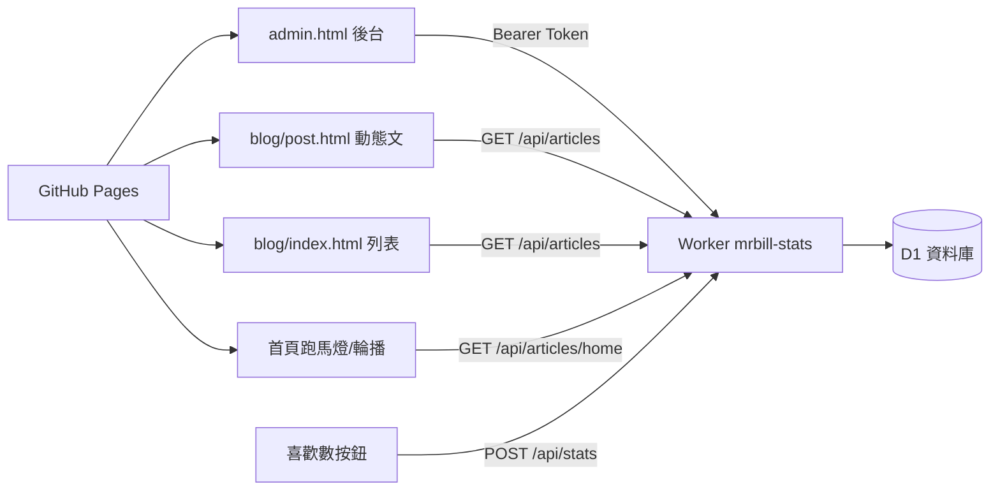

# Mr.Bill 數位實驗室 — 操作手冊（RUNBOOK）

> 最後更新：**2026-06-08**  
> 用途：關掉 Cursor 後，照這份文件就能知道怎麼操作、怎麼部署、API 怎麼串、出錯怎麼查。

---

## 一、專案是什麼

| 層級 | 技術 | 說明 |
|------|------|------|
| 前台網站 | GitHub Pages | 靜態 HTML/CSS/JS，網址 `https://mrbill-dev.github.io/` |
| 後台 CMS | `admin.html` | 本機或公司內網開啟，**不推密碼到 Git** |
| 後端 API | Cloudflare Worker `mrbill-stats` | 文章 CRUD、喜歡數、首頁設定 |
| 資料庫 | Cloudflare D1 `mrbill-stats` | SQLite，存動態文章與統計 |



---

## 二、目前狀態（2026-06-08 請自行勾選）

每次做完部署，在這裡打勾，下次才不會忘：

- [ ] GitHub 已 push 到 `origin/main`
- [ ] Worker 已 `wrangler deploy`
- [ ] D1 migration 已跑到 **v4**（`title_font` 欄位）
- [ ] `js/admin/admin.config.local.js` 已設定（本機，不進 Git）
- [ ] Cloudflare `ADMIN_TOKEN` secret 已設定

**近期重要 commit：**

| Commit | 內容 |
|--------|------|
| `79ebe7e` | SEO/GEO 統一、FAQ、後台 SEO 檢查面板 |
| `0dee1e5` | 標題字體切換（黑體/明體）、雨天文明體修復、Worker `title_font` |
| `a368a65` | 儲存後驗證字體、錯誤提示、快取版本號 |

---

## 三、API 串接（照這做就對了）

### 3.1 Worker 網址（全站共用）

```
https://mrbill-stats.billhuang19get.workers.dev
```

### 3.2 前台會用到的設定檔

| 檔案 | 變數 | 用途 |
|------|------|------|
| `js/blog-articles.config.js` | `BLOG_ARTICLES_API` | 動態文章列表／內文 |
| `js/blog-stats.config.js` | `BLOG_STATS_API` | 喜歡數 |
| `js/admin/admin.config.local.js` | `MRBILL_ADMIN` | **後台專用**（本機，gitignore） |

前台兩個 config **已寫死 production 網址**，公司預覽站與 GitHub 正式站共用同一 Worker。  
本機 `localhost` 開發時會自動改連 `http://localhost:8787`。

### 3.3 後台本機設定（必做一次，不推 Git）

1. 複製範例檔：

   ```
   js/admin/admin.config.example.js
   → js/admin/admin.config.local.js
   ```

2. 填入（密碼要與 Cloudflare Secret 相同）：

   ```javascript
   window.MRBILL_ADMIN = {
     apiBase: "https://mrbill-stats.billhuang19get.workers.dev",
     apiToken: "你的管理密碼（至少 8 字）"
   };
   ```

3. `admin.config.local.js` 已在 `.gitignore`，**絕對不要 commit**。

### 3.4 Cloudflare 管理密碼（Worker Secret）

```powershell
cd backend\mrbill-worker
$env:CLOUDFLARE_API_TOKEN = "你的Cloudflare_API權杖"
$env:NODE_TLS_REJECT_UNAUTHORIZED = "0"
npx wrangler secret put ADMIN_TOKEN
```

貼上與 `admin.config.local.js` 裡 `apiToken` **相同**的密碼。

### 3.5 API 端點一覽

**公開（訪客，不需密碼）**

| 方法 | 路徑 | 說明 |
|------|------|------|
| GET | `/api/articles` | 已上架動態文章列表 |
| GET | `/api/articles/{slug}` | 單篇（含 `contentHtml`） |
| GET | `/api/articles/home` | 首頁跑馬燈 + 輪播資料 |
| GET/POST | `/api/stats` | 喜歡數（需 `x-bsz-referer` header） |

**管理（需 `Authorization: Bearer {ADMIN_TOKEN}`）**

| 方法 | 路徑 | 說明 |
|------|------|------|
| GET | `/api/admin/articles` | 全部文章（含草稿） |
| GET | `/api/admin/articles/{slug}` | 單篇完整資料 |
| POST | `/api/admin/articles` | 新建文章 |
| PUT | `/api/admin/articles/{slug}` | 更新文章 |
| DELETE | `/api/admin/articles/{slug}` | 下架（`?purge=1` 永久刪） |
| GET/PUT | `/api/admin/settings/home-strip` | 首頁橫幅設定 |

### 3.6 動態文章在前台怎麼顯示

| 情境 | 網址 |
|------|------|
| 讀者看已上架文 | `blog/post.html?slug=你的-slug` |
| 管理員預覽草稿 | `blog/post.html?slug=…&preview=1`（須先在 admin 登入） |
| 文章列表 | `blog/index.html`（靜態 4 篇 + 動態上架文合併） |

靜態 4 篇（不可在後台覆寫 slug）：

- `2026-05-31-ai-prompt-six-levels`
- `2026-06-05-ai-workflow-lesson-01-02`
- `2026-06-06-ai-workflow-lesson-04-06`
- `taipei-newtaipei-rainy-day-family`（雨天親子，專屬明體版型）

---

## 四、日常操作 SOP

### 4.1 開後台

1. 用瀏覽器開 `admin.html`（本機路徑或公司內網）
2. 輸入 `apiToken`（或已在 localStorage 記住）
3. 左側選文章，或按「新增文章」

### 4.2 新增／編輯一篇文章

1. 填 slug、標題、摘要、正文（可用「插入版型」按鈕）
2. **標題字體**：黑體（預設）或 明體（生活筆記）
   - 只影響：大標題 + 標準章節卡直層 `h2`
   - **不影響**：卡片內小標、FAQ、雨天親子靜態文
3. 狀態選「已上架」或「排程」
4. 按 **儲存**
5. 看狀態列：
   - 「已儲存」→ 成功
   - 「標題字體未寫入資料庫」→ 見下方故障排除（migration v4）
6. 按「預覽前台」確認版型
7. 按「文章列表」確認出現在 `blog/index.html`

### 4.3 標題字體存在哪裡

- **不是**改 `content_html` 正文
- 是 D1 `articles` 表的 **`title_font`** 欄：`sans` 或 `serif`
- 前台 `blog/post.html` 載入後由 JS 加 `body.blog-title-font-serif` class

### 4.4 首頁曝光

後台勾選：

| 勾選項 | 效果 |
|--------|------|
| 首頁跑馬燈 | header 下橫幅（與雨天親子常駐輪播） |
| 首頁輪播 | 首頁「精選文章輪播」區 |
| 列表精選 / 列表版型 | 控制 `blog/index.html` 大卡或精簡列 |

---

## 五、部署完整流程

```text
本機改檔 → 本機測試 → git commit → GitHub push → D1 migration（若有新欄位）→ wrangler deploy → 前台驗證
```

### 5.1 只改前台（HTML/CSS/JS，沒動 Worker）

1. 改檔、本機預覽
2. GitHub Desktop → Commit → Push
3. 等 GitHub Pages 更新（通常 1～3 分鐘）
4. 強制重新整理（Ctrl+F5）

### 5.2 有改後端（Worker / 資料庫欄位）

```powershell
cd backend\mrbill-worker
$env:CLOUDFLARE_API_TOKEN = "你的API權杖"
$env:NODE_TLS_REJECT_UNAUTHORIZED = "0"

# 依需要執行對應 migration（見第六節）
npx wrangler d1 execute mrbill-stats --remote --file=./migrate-articles-v4.sql

npx wrangler deploy
```

### 5.3 Git push 若 403

錯誤：`Permission denied to xtxgmxa`  
→ 用 **GitHub Desktop** 換成正確帳號再 Push，不要用錯誤的 git credential。

### 5.4 公司網路 Wrangler 登入失敗

若 OAuth 登入失敗，一律改用 **API Token**（見 3.4）。  
也可到 Cloudflare Dashboard → D1 → Console 手動貼 SQL 執行。

---

## 六、資料庫 Migration 對照表

| 檔案 | 新增欄位／表 | 錯誤訊息 |
|------|-------------|----------|
| `migrate-articles-v2.sql` | `status` 等基礎欄位 | `no such column: status` |
| `migrate-articles-v3.sql` | `list_style` | `no such column: list_style` |
| `migrate-articles-v4.sql` | **`title_font`** | `no such column: title_font` |
| `migrate-site-settings.sql` | 首頁橫幅設定表 | 橫幅設定儲存失敗 |

**目前文章表重要欄位：**

`slug`, `title`, `content_html`, `status`, `published_at`, `list_style`, **`title_font`**, `featured`, `home_marquee`, `home_carousel`, `sort_order`, …

---

## 七、故障排除

| 現象 | 可能原因 | 解法 |
|------|----------|------|
| 後台 401 Unauthorized | Token 錯或未設 | 檢查 `admin.config.local.js` 與 Cloudflare `ADMIN_TOKEN` 是否相同 |
| 儲存失敗 `no such column: title_font` | DB 未升級 | 跑 `migrate-articles-v4.sql` + deploy |
| 選明體但前台沒變 | Worker 舊版或未 deploy | `wrangler deploy`；強制重新整理 `post.html` |
| 選明體但後台跳警告 | 儲存後讀回仍是 sans | 同上，確認 D1 有 `title_font` 欄 |
| 動態文列表空白 | API 連不到或無上架文 | 確認 `blog-articles.config.js` 網址；文章狀態是否 `published` |
| 預覽草稿失敗 | 未登入後台 | 先開 `admin.html` 登入，再開 `preview=1` 網址 |
| 喜歡數不動 | stats API 或 CORS | 確認 `blog-stats.config.js` 網址 |
| 雨天親子字體不對 | 被全域 CSS 蓋掉 | 應走 `blog-rainy-family.css`；靜態文不受 `title_font` 影響 |

---

## 八、關掉 Cursor 後，怎麼問 AI 最省額度

**原則：一次給足上下文，禁止全專案掃描。**

複製下面模板，貼到新對話開頭：

```text
專案：MrBill-Dev（GitHub Pages + Cloudflare Worker mrbill-stats）
請先讀 RUNBOOK.md，不要全專案掃描。

目前分支：main
最新 commit：<貼 git log -1>
部署狀態：
- GitHub push：已/未
- wrangler deploy：已/未
- D1 migration 版本：v2/v3/v4

這次目標：<一句話>
錯誤訊息：<完整貼上>
相關檔案：<最多 3～5 個路徑>
```

**範例：**

```text
專案：MrBill-Dev
請先讀 RUNBOOK.md，不要全專案掃描。
最新 commit：a368a65
部署狀態：push 已、deploy 未、migration v4 未
目標：後台選明體儲存後前台沒變
錯誤：儲存顯示「標題字體未寫入資料庫」
相關檔案：backend/mrbill-worker/src/index.js, js/admin/admin-app.js
```

---

## 九、關鍵檔案速查

| 路徑 | 做什麼用 |
|------|----------|
| `admin.html` | 後台入口 |
| `js/admin/admin-app.js` | 後台邏輯 |
| `js/admin/admin.config.local.js` | API 網址 + Token（本機） |
| `js/admin/blog-content-snippets.js` | 正文 HTML 版型 |
| `js/blog-articles.js` | 文章列表、動態文頁、SEO、字體 class |
| `js/blog-articles.config.js` | 動態文章 API 網址 |
| `js/blog-stats.config.js` | 喜歡數 API 網址 |
| `blog/post.html` | 動態文章殼層 |
| `css/blog-layout.css` | 通用文章版型 + CMS 字體 class |
| `css/blog-rainy-family.css` | 雨天親子專屬（明體） |
| `backend/mrbill-worker/src/index.js` | Worker 全部 API |
| `backend/mrbill-worker/ADMIN-SETUP.md` | 後端安全與首次上線細節 |

---

## 十、本機快速指令

```powershell
# 看目前狀態
git status -sb
git log -3 --oneline

# 部署後端
cd backend\mrbill-worker
$env:CLOUDFLARE_API_TOKEN = "你的權杖"
$env:NODE_TLS_REJECT_UNAUTHORIZED = "0"
npx wrangler d1 execute mrbill-stats --remote --file=./migrate-articles-v4.sql
npx wrangler deploy

# 本機跑 Worker 開發（可選）
npx wrangler dev
```

---

## 十一、更新這份文件的時機

每次做完下面任一事，請更新 **第二節勾選** 與 **日期**：

- 新功能上線
- 跑過新的 migration
- 換 Worker 網址
- 換 ADMIN_TOKEN
- 新增靜態文章或改版型規則
